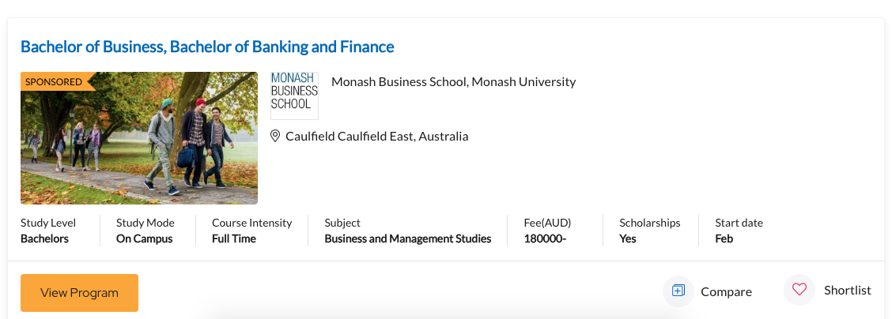
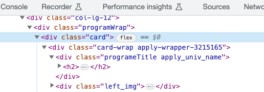
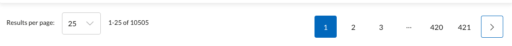
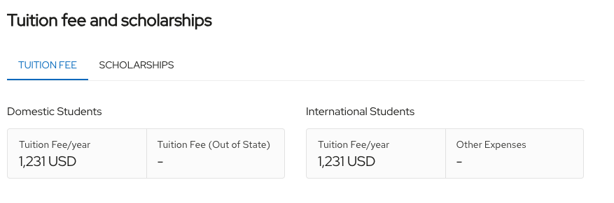
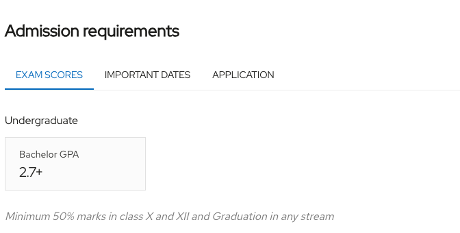
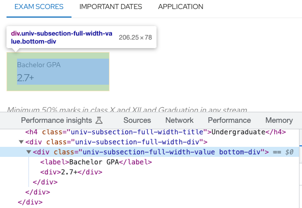

```{r setup, include=FALSE}
knitr::opts_chunk$set(echo = FALSE, eval=FALSE)
library(knitr)
library(dplyr)
```

## Introduction

These are the development notes for scraping data from [Top Universities](www.topuniversities.com) and [Times Higher Education](www.timeshighereducation.com). Since, both websites present data as dynamic content they require the use of a headless browser to simulate the user clicking through the sites to generate the content. 

The best tool for that kind of scraping in the R ecosystem is [RSelenium](https://docs.ropensci.org/RSelenium/).

## Installing RSelenium

RSelenium requires the `Rjava` package. `Rjava`, in turn, requires access to the Java runtime. I recommend installing [Azul Java](https://www.azul.com/downloads/#zulu). Instructions vary with OS. 

We also need a browser that works with RSelenium. The provided scripts work with Chrome.

## Scraping Top Universities

The topuniversities.com websites provides a [programs finder](https://www.topuniversities.com/programs?qs_qp=topnav). We used this tool to extract information for programs related to Bioinformatics, Machine Learning and Data Science. This is how the website presents the data:



To scrap the data, it is necessary to understand the structure of the generated markup in each page. In this case, the data is presented inside a `div` element with a `card` class: 




```{r}
cards <- remDr$findElements(using="css", ".card")
```

The findElements method finds all elements with a class of `card`. The helper function `extract_row` is applied to all found cards to extract the required data using css selectors.

To start scraping the website, we use RSelenium's `rsDriver` to connect to a browser:

```{r}
library(RSelenium)
rs_driver_object <- rsDriver(browser='chrome',
                             port=free_port(),
                             chromever = "114.0.5735.16")
```

Once the connection with the browser is established, we navigate to the starting url.

```{r}
url <- "https://www.topuniversities.com/programs/bahrain/biological-sciences?country=[OM,PS,AE,BH,IR,IQ,JO,SA,KW,QA,SY,YE,CY,TR,IL,LB,GB,EG]&subjects=[462,468,4049,4055,494,496,554,500,502,508]&pagerlimit=[25]"
remDr$navigate(url)
```


This url encodes a starting query of the programs we are interested in, filtering programs with the subjects of Biological Sciences, Computer Science and Information Systems, Data Science, Genetics, Mathematics, Medicine Related Studies, Pharmacology, Pharmacy and Pharmacology, Physics and Astronomy, Statistics and Operational Research in Bahrain, Cyprus, Egypt, Iran, Iraq, Israel, Jordan, Kuwait, Lebanon, Oman, Palestine, Qatar, Saudi Arabia, Syria, Turkey, United Arab Emirates (UAE) and Yemen. The website presents the data in pages of 25 elements:




The scripts queries one page at a time and downloads the data for each. The function `scrap_page(i)` scraps page i from this query. The 25 results from each page are saved to the `temp` folder.

Since the requirements information for each program are not available in this page, we save a link to the program's page to scrap the data from requirements and tuition in a second pass.

After scraping all the pages, we merge all the programs into a single data frame and save it:

```{r, eval=FALSE}
files <- list.files('./temp', pattern = ".rds", full.names = TRUE)

# read files and merge
programs <- files %>%
  as.list %>%
  purrr::map_df(~readRDS(.))
 
# save
saveRDS(programs, './data/programs.rds')
```

### Scraping the requirements and tuitions data

The script `scrap_programs_tution_fees.R` takes the list of urls scraped previously and downloads the tuition fee and requirements data from the program pages. 

Since these are static html pages, it is not necessary to use a browser to access this data. The html pages are downloaded with `rvest::read_html`.


This is how the webpages presents the tution fee data:



And the requirements:


The associated markup:



To extract the necessary information, we download the html page using `read_html`, and then we specify css selectors that have the information we need to the `html_elements`.

```{r}
html <- read_html(url)

html %>% 
    html_element("#p2-tuition-fee-and-scholarships") %>% 
    html_elements(".univ-subsection-value") 
```


### Cleaning up the data

After scraping the data from all the programs, it is necessary to clean it by removing duplicates, parsing the requirements information and converting tuition fees to the same currency (British Pounds), removing programs that are not related to Machine Learning and Data Science.

Parsing each programs requirements involves taking the string from the html webpage and converting it to columns in our dataset. Each column corresponds to a requirement (TOEFL, IELTS, etc.). The value for each program in the column represents the minimum requirement of the program.

Currencies reported for the tuition fees are reportes in Euro, US Dollars, British Pounds and Singapore Dollars. I used the following exchange rates to convert currencies to British Pounds:

```{r eval=TRUE}
tibble::tibble(
  Currency=c("USD", "EUR", "SGD"),
  Exchange=c(1.3, 1.16, 1.72)
) %>% 
  kable
```


The final dataset has 5356 programs. Here are the basic stats from the dataset:

```{r eval=TRUE}
df <- readRDS('../data_output/programs_geolocated.rds')
skimr::skim(df)
```


## Scraping timeshighereducation.com

The website also renders data dynamically, so we connect to it through a browser. The initial url is https://www.timeshighereducation.com/world-university-rankings/2023/world-ranking#!/length/-1/sort_by/rank/sort_order/asc/cols/stats

The data is presented in a single page, so it is easier to scrap. The script that achieves this is `scrap_rankings.R`. It uses the same functions from `Rselenium` and another custom function to extract the data from the webpage. 

The scraped data is located in `data_output/the_ranking_data.rds`, and it includes 267 universities with its ranking and scores on the following categories: overall score, teaching, research, citations, industry income and international outlook.

```{r eval=TRUE}
ranks <- readRDS('../data_output/the_ranking_data.rds')
skimr::skim(ranks)
```

## Geocoding and merging

To geocode the downloaded data, we used the [Google Maps API](https://developers.google.com/maps/) and the `tidygeocoder` [package](https://jessecambon.github.io/tidygeocoder/). The script that does this is `geocode_programs.R`. The Google maps API requires an API key.

The final data for the Shiny app requires merging the data from different sources. Some of the university names are different, so a little bit of manual processing was necessary.


